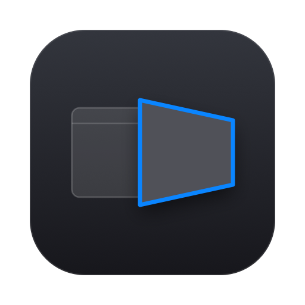
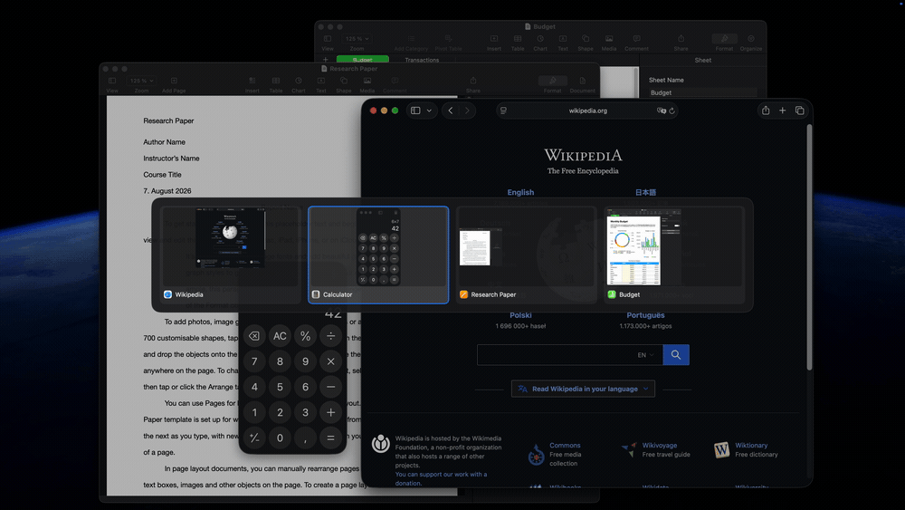
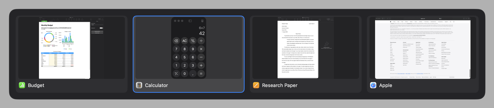

<p align="center">
  
</p>

<h1 align="center">Flip</h1>

<p align="center">
  A window switcher for macOS that gets out of the way.<br>
  Hold Option, tap Tab. Let go before you can see it and it never draws at all.
</p>

<p align="center">
  <a href="https://github.com/mxwnk/flip/releases/latest"></a>
  
  <a href="LICENSE"></a>
</p>

<p align="center">
  
</p>

## Install

```sh
brew install --cask mxwnk/flip/flip
```

Or take the disk image from the [latest
release](https://github.com/mxwnk/flip/releases/latest) and drag Flip into
Applications.

Needs macOS 14 or newer.

## What it does

- **Switches windows, not applications.** Every window on the space, most recently
  used first, so two documents in the same app are two entries.
- **Stays out of the way.** Let go inside 150 ms and it switches without drawing
  anything at all.
- **One key per application.** `⌥ S` for Spotify, `⌥ T` for the terminal, yours to
  choose.
- **Moves and resizes windows** from the keyboard — halves, quarters, filling, and
  across to the other display.
- **Keyboard or mouse.** Hover to pick, click to confirm, if your hand is already
  there.
- **Brings minimised windows back.** Choosing one lifts it out of the Dock.

## Switching windows

| | |
| --- | --- |
| `⌥ Tab` | every window on the current space, most recently used first |
| `⌘ Tab` | the windows of whichever application is in front |
| `⌥ S` | jump straight to Spotify — one key per application, yours to choose |
| `⌥` held, then a key | narrow the open grid to that application |
| arrows, `esc` | move the selection, or give up |
| the mouse | hover to select, click to confirm; click beside the grid to give up |
| let go of `⌥` | focus what is selected, out of the Dock if it was minimised |

Add `⇧` to any of those to go backwards.

<p align="center">
  
</p>

## Moving windows

| | |
| --- | --- |
| `⌃⌥←` `⌃⌥→` | left or right half |
| `⌃⌥↑` `⌃⌥↓` | top or bottom half |
| `⌃⌥U` `⌃⌥I` `⌃⌥J` `⌃⌥K` | the four quarters |
| `⌃⌥↩` | fill the screen, or put it back if it already fills |
| `⇧⌥←` `⇧⌥→` | previous or next display, keeping the window's place on it |

Everything stops at the menu bar and the Dock. Filling is a toggle: press it on a
window that already fills and it goes back where it was.

## Settings

**Settings…** in the menu bar, or `⌘,`. Every change applies as you make it.

- **General** — start at login, the two hotkeys, which display the grid opens on,
  how long Option must be held before it does, thumbnails or plain icons, windows
  from every space, and the update check.
- **Shortcuts** — one key per application. The editor warns when a key would
  shadow a character you need to type.
- **Windows** — the keys above, listed so you can find them without this page.
- **Excluded** — applications kept out of the grid. A key bound directly to one
  still reaches it.

**Pause** in the menu bar hands `⌘ Tab` back to macOS for as long as a screen
share lasts.

## Questions

**Why does a window switcher want Screen Recording?** Only for the thumbnails.
Turn them off in Settings and Flip shows application icons instead — and stops
asking for it.

**macOS says it cannot verify Flip.** It is signed with its own certificate rather
than notarised through Apple's paid programme. Homebrew clears that for you; a
copy installed by hand has to be allowed once under System Settings › Privacy &
Security.

**Do I have to grant the permissions again after every update?** No. The signature
is pinned to the same certificate on every release, and the pipeline refuses to
publish one where it has drifted.

**Where do my settings live?** As readable JSON in `~/Library/Application
Support/Flip/`. Edits to `bindings.json` are picked up while Flip runs; changes to
`settings.json` need a restart.

**Something is wrong and I want to report it.** **Copy Diagnostics** in the menu
puts the version, both permissions, every setting and Flip's recent log on the
clipboard — enough for an issue without opening a terminal.

## Contributing

Open work and known gaps live in
[issues](https://github.com/mxwnk/flip/issues). Building, testing and releasing
are in [docs/development.md](docs/development.md); what changed in each release is
in [CHANGELOG.md](CHANGELOG.md).

## License

MIT. See [LICENSE](LICENSE).
